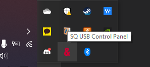
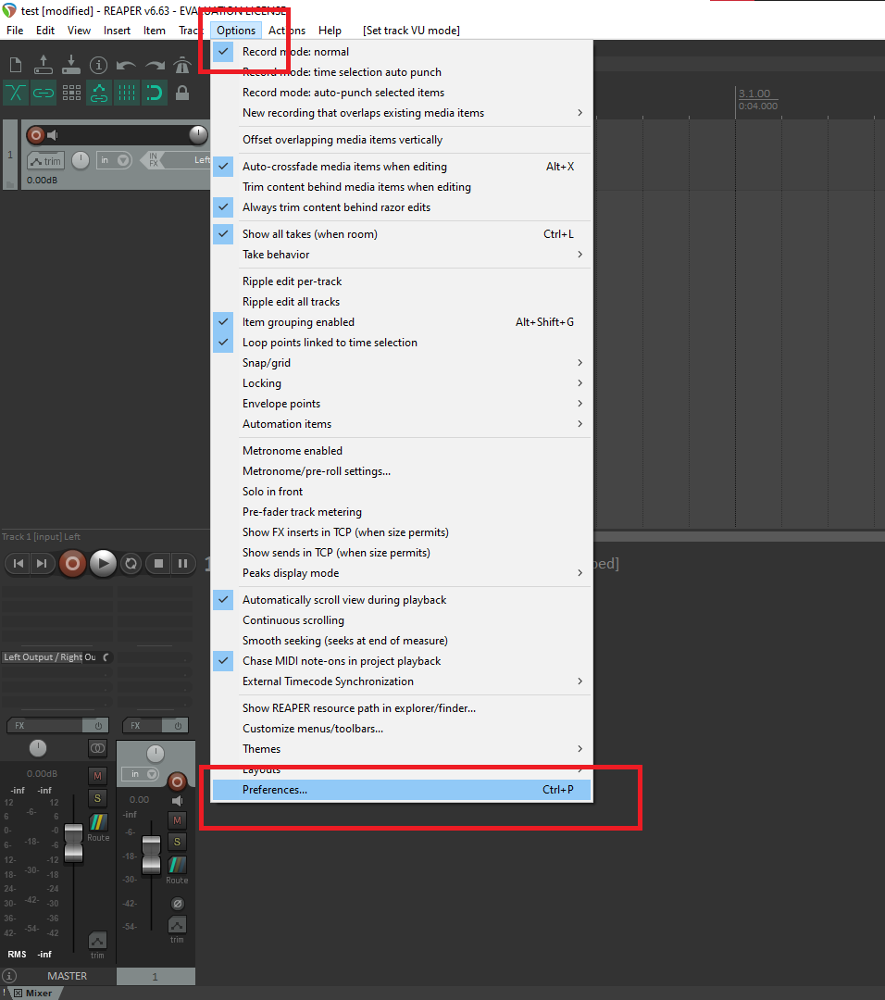
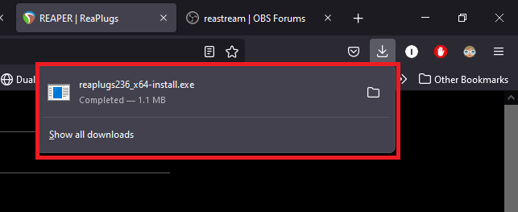
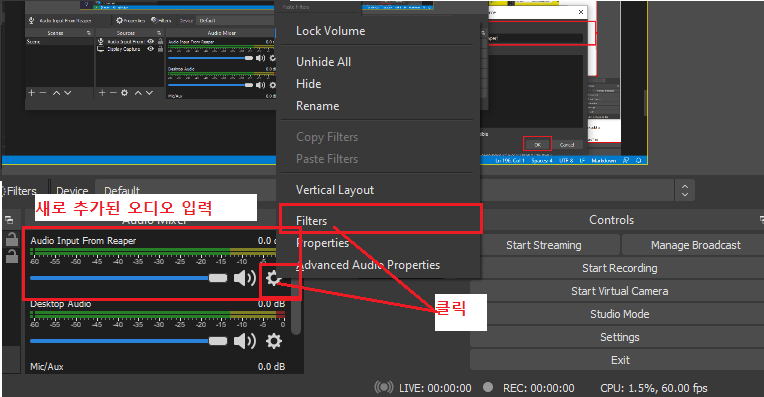

## Table of Contents
1. [리퍼 다운로드 방법](#리퍼-다운로드-방법)
2. [화면 설명](#화면-설명)
    1. [사용하기 전 설정해야 할 부분](#사용하기-전-설정해야-할-부분)
3. [리퍼를 믹서(ALLEN&HEATH SQ-6)에 연결해서 사용하기](#리퍼를-믹서allenheath-sq-6에-연결해서-사용하기)
    1. [사운드 드라이버 설정](#사운드-드라이버-설정)
    2. [SQ-6에서의 설정](#sq-6에서의-설정)
    3. [SQ-6에서 보내는 신호를 개별 Track으로 받기](#sq-6에서-보내는-신호를-개별-track으로-받기)
    4. [SQ-6로부터의 32개 인풋을 트랙으로 받은 이후](#sq-6로부터의-32개-인풋을-트랙으로-받은-이후)
    5. [멀티트랙 녹음 및 유튜브 송출 시작](#멀티트랙-녹음-및-유튜브-송출-시작)
    6. [OBS 송출을 위한 ReaStream 플러그인 설치, 사용하기](#obs-송출을-위한-reastream-플러그인-설치-사용하기)
    7. [유튜브 볼륨 조절을 위한 OBS 추가 설정 (추가 예정)](#유튜브-볼륨-조절을-위한-obs-추가-설정)
4. [트랙에 관한 자세한 설명 (작성중)](#트랙에-관한-자세한-설명)
    1. [트랙을 인풋 채널로 사용하기 (추가 예정)](#트랙을-인풋-채널로-사용하기)
    2. [트랙에 프로세싱(EQ, Reverb, Pan, ...) 추가하기 (추가 예정)](#트랙에-프로세싱eq-reverb-pan--추가하기)
    3. [Reverb를 위한 Dragonfly 플러그인 설치, 사용하기 (추가 예정)](#reverb를-위한-dragonfly-플러그인-설치-사용하기)
    4. [트랙을 Bus 채널로 사용하기 (추가 예정)](#트랙을-bus-채널로-사용하기)
#

# Reaper란 무엇인가
리퍼는 DAW, Digital Audio Workstation이라고 불리는 컴퓨터 프로그램 중 하나이다. 오디오 및 음악의 녹음, 편집(믹싱), 재생을 하는 프로그램이라고 이해하면 된다.

리퍼는 특유의 화면 디자인과 한국어 미지원 문제로 인해 입문이 다소 어렵다고들 한다. 하지만 처리속도가 빠르고 한번 익숙해지만 다른 DAW 프로그램도 쉽게 다룰 수 있다는 이점이 있다.

# 리퍼 다운로드 방법

리퍼는 공짜가 아니다. 개인과 영세 사업자는 약 6만원을 지불하고 사용할 수 있다. 그러나 5초간의 대기 후 무료로 사용하게 허락하기 때문에 사용자 입장에선 구입 시점을 다소 미룰 수 있다.

# 화면 설명

상단의 사진이 리퍼를 처음 시작했을 때 보이는 화면이다.
디자인이 투박하고 불친절한데, 이는 사용자가 익숙해져야 하는 부분이다. 

1번 부분은 아직 사용해본 적이 없으니 넘어가도록 하겠다.

2번 부분은 녹음, 재생, 정지, 일시정지 버튼 등이다.

3번은 마스터 트랙이다. 믹서의 MainLR 채널과 동일하다고 보면 된다.

Ctrl-T를 눌러 트랙을 추가해보자. 

다음과 같이 새로운 트랙이 추가된 것을 볼 수 있다.

상단 붉은 박스에 추가된 것은 Track Panel (트랙 패널)이고, 하단 붉은 박스에 추가된 것은 Mixer Panel (믹서 패널)이다. 

리퍼를 처음 사용한다면, Ctrl-T를 눌러 추가한 트랙 패널에 버튼이 몇 개 없는 것을 발견하게 된다. [사용하기 전 설정해야 할 부분](#사용하기-전-설정해야-할-부분)의 설명을 따라 레이아웃을 바꿔주면 된다.

후술하겠지만 트랙은 디지털 믹서 (ALLEN&HEATH SQ-6) 기준 하나의 채널처럼 동작한다. 인풋 채널처럼 사용할 수 있고, Aux 채널처럼 사용할 수 있다. 개별적으로 각종 Fx (EQ, Comp, Reverb)들을 넣을 수도 있다.

## 사용하기 전 설정해야 할 부분

상단 메뉴 -> Options -> Themes -> Theme Adjuster / Color Controls 를 클릭한다

아래 이미지 (Track Control Panel)가 나올 때까지 화살표를 누른다.

LAYOUT A가 선택된 상태에서 Hide 버튼을 죄다 눌러서 아래 그림과 같이 만들어준다.

이렇게 하는 이유는 기본 설정에서 Track의 버튼 몇 개가 숨겨져 있기 때문이다.

이런 설정을 해주지 않는다면 저 버튼들 몇 개를 찾느라 1시간을 낭비하게 된다.
이거 작성하면서도 저 버튼들 때문에 30분을 추가로 날렸다.

만일 설정을 따랐는데도 버튼 몇 개가 보이지 않는다면 트랙 크기가 너무 작아서 버튼이 전부 보여지지 않는 것이다. 아래 화면에서 붉은 화살표 부분에 커서를 갖다대로 클릭한 후 좌우로 움직여 트랙 패널 사이즈를 조정해주면 된다.

# 리퍼를 믹서(ALLEN&HEATH SQ-6)에 연결해서 사용하기
리퍼를 믹서에 연결하면, 믹서로부터 32채널을 받을 수 있고, 또 믹서로 최대 32채널을 보낼 수 있다. 리퍼를 예배 때 유튜브로 따로 송출하기 위한 보조믹서로 사용하거나, 믹서를 통해 공연 등을 녹음하고 파일로 저장할 때 유용하다.

## 사운드 드라이버 설정
만일 리퍼를 믹서에 연결해서 사용한다면 사운드 드라이버를 따로 설정해야 한다.
사운드 드라이버를 설정한다는 것은, 쉽게 말해 컴퓨터에 연결된 여러 개의 스피커, 마이크 중 어느 것에 리퍼를 연결해 사용할지를 결정한다는 것이다.

우리는 SQ-6 믹서를 리퍼 프로그램의 마이크 겸 스피커로 사용할 것이다. 첫 번째 컴퓨터가 믹서를 사운드 드라이버(ASIO 드라이버)를 통해 인식하는 것이다. 이를 위해 먼저 컴퓨터에 ASIO 드라이버를 설치한 뒤, USB 케이블로 컴퓨터와 믹서를 연결해야 한다.
제대로 연결되었다면 다음과 같은 드라이버 로고를 화면 우하단에서 확인할 수 있다.
 

그 다음 할 일은 리퍼의 사운드 드라이버를 ASIO 드라이버로 설정하는 것이다.

Options -> Preferences... 를 선택하면 설정 창이 나타난다.

붉은 박스를 따라 Audio System을 ASIO로 설정한다.

(해당 사진은 업데이트 예정)
해당 사진처럼 되면 잘 된 것이다.
inputs의 first를 channel 1로 설정하고, last를 channel 32로 설정하면 32개의 각기 다른 인풋을 SQ-6 믹서로부터 받을 수 있다. (SQ-6가 보내주는 것을 리퍼가 받는 것이다.)
Output range도 32채널까지 활용할 수 있지만, 현재 유튜브 송출용으로는 Output을 설정해줄 필요가 있진 않다. first는 channel 1으로 설정하고, last는 channel 2로 설정하자. 이렇게 설정하면 리퍼 프로그램이 SQ-6 믹서로 보내는 아웃풋이 2개의 채널뿐이 된다. 다른 설정을 특별히 하지 않는다면 마스터 트랙([화면 설명](#화면-설명) 참조)의 스테레오 출력이 1, 2번 Output channel을 통해 SQ-6로 보내진다.

## SQ-6에서의 설정
사운드 드라이버 설정을 끝냈다면 리퍼는 이제 32 채널의 인풋을 SQ-6로부터 받고, 또 SQ-6로 2개의 채널을 보내게 설정되어 있다.

이제 SQ-6에서 설정해줘야 하는 것은, 리퍼로 전달되는 32개의 채널에 각각 어떤 신호를 보내줄 것인가이다. 우리가 리퍼를 사용하는 목적은 찬양 중에 마이크와 악기의 신호를 받아 따로 믹싱하는 것이다. SQ-6 콘솔의 I/O 섹션에서 설정해줄 수 있다.

[SQ-6 I/O Tie Line 그림 (추가 예정)]

사진에 나온 붉은 박스를 보자.
SQ-6 콘솔의 I/O 버튼을 누른 다음 Tie Line 버튼을 선택한다.
왼쪽에서는 SLink나 Local을 선택하고, 오른쪽 위에서는 USB를 선택한다.

그리고 아래 테이블과 그림처럼 SLink와 Local을 통해 SQ-6로 들어오는 입력들을 USB 채널 1-32로 보내준다.

[SQ-6 I/O Tie Line 스크린샷 (추가 예정)]
[Tie Line - USB 연결 테이블 (추가 예정)]

SQ-6에서 리퍼로 신호를 보낼 때 Tie Line이 아닌 Outputs -> IP Direct Outputs, USB를 선택해서 사용하는 것이 더 낫지 않나 생각할 수도 있다. IP Direct Outputs에서 리퍼로 보내주면 Tie Line과는 달리 L1, KEY1 같은 채널 이름을 표기해주기 때문에 더 쉽다는 장점이 있다.

그렇지만 IP Direct Outputs를 사용할 경우 SQ-6에서 각 입력 채널마다 적용되는 HPF, Gate, EQ, Comp 등의 프로세싱이 이미 적용된 신호를 리퍼로 보내게 된다. 그러나 저런 프로세싱은 교회 본당에서 좋은 소리를 내기 위해 설정된 것들이다.  이렇게 되면 리퍼에서 유튜브 송출을 위해 추가로 프로세싱을 하더라도 명료도만 떨어질 뿐 실질적인 이득은 보지 못한다. 리퍼를 볼륨조절 용도로만 사용하게 되는 것이다. 나쁘지 않지만 굳이 리퍼까지 끌어와 사용할 일은 아니다.

반면에 I/O 섹션의 Tie Line 기능을 사용하면 Preamp만을 거친 직후 디지털 신호로 변환된 신호를 리퍼로 보내줄 수 있다. (본당용으로 프로세싱되기 전 신호를 리퍼로 보내주는 것이다.) 이 신호를 리퍼의 개별 트랙에서 받은 다음 Gate, EQ, Comp, Reverb 등의 프로세싱을 주고 사운드 밸런스를 맞추면 유튜브로 더 좋은 소리를 송출할 수 있다. 

## SQ-6에서 보내는 신호를 개별 Track으로 받기

이제 SQ-6에서 보내주는 싱어들과 세션들, Podium 등의 소리를 리퍼에서 받을 차례이다.

먼저 Ctrl-T를 눌러 트랙을 하나 추가해주자.

사진엔 이미 여러 개의 트랙이 있지만 새로 생성한 트랙에만 집중하면 된다.
사진에 표시된 부분을 더블클릭하여 트랙의 이름을 설정할 수 있다.
Leader mic (L2)로 적어주자. 

이제 SQ-6에서 보내주는 L2(인도자)의 소리를 이 트랙에서 받도록 설정할 것이다.

우리는 [# SQ-6에서의 설정](#SQ-6에서의-설정)에서 L2(인도자)의 소리는 SQ-6 I/O 섹션에서 설정한 Tie Line을 통해 리퍼의 input 20 채널로 보내지도록 설정했다.

사진에 보이는 버튼을 좌클릭한 후 Input: Mono를 따라가면 channel 1, channel 2, ..., channel 32까지의 목록이 전부 나타난다. (사진엔 Left와 Right만 나와 있는데, 내 컴퓨터가 SQ-6에 현재 연결되어있지 않기 때문이다)

저 32개의 채널은 [# SQ-6에서의 설정](#SQ-6에서의-설정)에서 SQ-6가 리퍼로 보내주도록 설정한 32개의 채널들이다. L2(인도자)의 소리를 20번 채널로 보내도록 설정했으니, 여기에서 Channel 20을 선택하면 이 트랙이 인도자 마이크의 소리를 받게 된다.

이제 사진에 표기된 붉은 버튼을 눌러 트랙을 켜자.

아래쪽 믹서 패널도 함께 바뀌고, 트랙 패널과 믹서 패널의 레벨 미터에 마이크 신호가 실시간으로 잡히기 시작할 것이다!

이제 남은 할 일은 남은 31개 채널을 위한 트랙을 만들어주는 것 뿐이다. 화이팅!

## SQ-6로부터의 32개 인풋을 트랙으로 받은 이후

32개의 트랙을 전부 설정했으면 [트랙에 관한 자세한 설명](#트랙에-관한-자세한-설명)의 내용을 따라 트랙들을 묶고 믹싱하면 된다.

## 멀티트랙 녹음 및 유튜브 송출 시작

첫째: 프로젝트를 새 이름으로 저장하자. 이때, Create subdirectory for project를 클릭해주자. 녹음을 시작하면 32개의 wav 파일이 한번에 생성되니 프로젝트 하나를 위해 폴더 하나를 생성해주는 것이 좋다.

둘째: 이미 녹음된 트랙들이 있는 경우, 드래그하여 선택한 뒤 지워준다. 자세한 순서는 사진 참조. 

마지막으로 ⏮ 버튼을 눌러 0분 0초로 정렬한 뒤, 녹음 버튼을 눌러 녹음을 시작한다.
이후 정지 버튼⏹을 누르면 녹음이 끝난다.

## OBS 송출을 위한 ReaStream 플러그인 설치, 사용하기
<현재 교회 PC에는 ReaStream 플러그인이 이미 설치되어 있으니 이 섹션의 내용은 생략해도 된다.>

OBS 송출은 ReaStream이라고 불리는 리퍼의 플러그인 중 하나를 통하여 이루어진다. 이를 위해서는 Reaper Plugin을 PC에 설치해줄 필요가 있다. [Reaper Plugin 다운로드 링크](https://www.reaper.fm/reaplugs/)에서 플러그인을 다운받아 설치하자.

대부분의 PC는 이제 64비트이니, 붉은 네모 박스가 쳐진 64비트 버전을 다운받자.

링크를 클릭하면 설치 파일이 다운로드된다. 클릭하여 실행해주자.

전부 기본 설정만 선택하면 된다. 가볍게 설치해주자.

리퍼를 열고 사진에 나온 내용을 따라 Master Track의 Fx 목록에 ReaStream을 추가한다.

ReaStream을 추가하면 ReaStream의 설정 창이 나타난다.

Recieve audio/MIDI 대신 Send audio/MIDI; IP를 선택한 후, 오른쪽의 드롭 다운 리스트에서 *local broadcast를 클릭해준다. 이후 창을 닫으면 설정이 알아서 저장된다.

이제 OBS를 켠다. ReaStream이 Master Track의 결과물을 보내주고 있으니 OBS에서 받을 수 있도록 설정해줘야 한다.

소스 창에서 +버튼을 누른 뒤, 오디오 입력 캡쳐를 누른다.

이름은 원하는 대로 설정해두면 된다. 나는 Audio Input From Reaper로 설정했다. 아마 교회에서는 '오디오 입력 캡쳐'라는 이름으로 되어있을 것이다.
그 다음 창에서는 그냥 OK만 누르면 된다. 무언가를 바꿔줄 필요는 없다.

새로 추가된 오디오 입력의 설정 버튼을 누른 후 '필터'를 클릭한다.

VST 2.x Plug-in을 선택하여 추가하고, 이름은 ReaStream으로 설정해준다. (다른 이름도 괜찮다.)

새로 추가된 필터에서 추가적인 설정이 필요하다. 드롭다운 리스트에서 reastream-standalone을 클릭한 후, Plugin Interface(플러그인 인터페이스)를 클릭하여 설정 창을 열자. identifier가 리퍼 프로그램에 있는 ReaStream의 인터페이스와 다르면 안 된다. 리퍼에서 소리가 나가고 있다면 설정 창에 있는 레벨 미터가 움직일 것이다.

이후 창을 닫고 OBS 메인 화면으로 돌아오면 우리가 ReaStream을 통해 추가한 오디오 입력 캡쳐의 레벨 미터가 움직이는 것을 볼 수 있다. 이러면 성공이다.

## 유튜브 볼륨 조절을 위한 OBS 추가 설정
<추가 예정인 부분입니다>
# 트랙에 관한 자세한 설명

SQ-6에 연결된 경우, 전술하였다시피 녹음 버튼을 눌러야 소리가 들어오기 시작한다.

## 트랙을 인풋 채널로 사용하기
<추가 예정인 부분입니다>
### 트랙에 프로세싱(EQ, Reverb, Pan, ...) 추가하기
<추가 예정인 부분입니다>
#### Reverb를 위한 Dragonfly 플러그인 설치, 사용하기
<추가 예정인 부분입니다>
## 트랙을 Bus 채널로 사용하기
<추가 예정인 부분입니다>